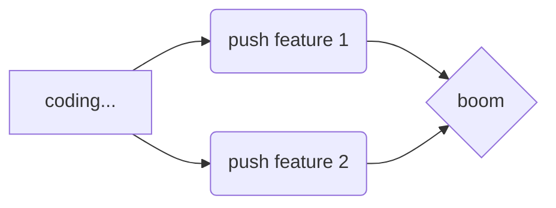

# 9 - Suggest Improvements
Now that you've been working in a trunk based project using many kind of feature flags, you are asked to reflect around your experience.

- What did you like with this work method?

We liked the ability to quickly toggle different functions on and off, especially from the database. We found it gave us more control over which section of the app was shown on the screen and certain aspects of development faster. Using the feature flags in the database connected to different user profiles made it easier to test different combinations of features. 

We liked that working trunk-based meant not having to keep track of different branches which removed the risk of working in a wrong branch. You can always be sure that you have the latest functions and features in the branch you are working on and not have to wait for colleagues branches to be merged.

- What didn't you like?

We do not yet understand how to implement code reviews in this kind of workflow and as new developers this is something that is very important to us so that we can learn from more experienced developers.

We did not like that we had to write a lot of extra code to be able to use feature flags and a lot of old code remained in the files which can bloat the size of the bundle. 

Working with cookies and flags saved in localStorage led to extra time being spent having to clear the information in the inspector to make sure that we were working with the right information when we were testing.

- Can you come up with a couple of ideas for how to improve the workflow?

We suggest that the dev team should have daily meetings to discuss code quality and provide education for each other so that you don't miss out on the benefits of code reviews.  

We would also suggest a much more test driven approach be used to protect production from bad code being accidentally pushed to the main branch.  This approach should include both unit and integration tests to make sure features behind different flags work together.

We suggest that localStorage should not be used at all for feature flags. Instead, an approach using feature flags in a realtime database works fine. If the project scales using a 3rd party tool should be looked into in order to standardize the process for all developers across the company and to avoid unnecessary business hours being spent creating an in-house solution.

Don't forget to [put a green checkmark](README.md) before you continue to the next task!

[Continue to the optional task!](10-implement-suggestions.md)

---
